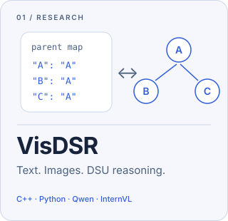
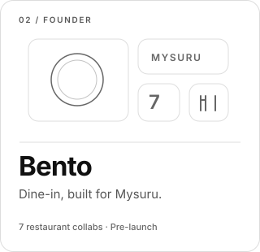
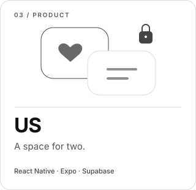

<picture>
  <source media="(prefers-reduced-motion: reduce) and (prefers-color-scheme: dark)" srcset="assets/hero-dark-static.svg">
  <source media="(prefers-reduced-motion: reduce)" srcset="assets/hero-light-static.svg">
  <source media="(prefers-color-scheme: dark)" srcset="assets/hero-dark.svg">
  
</picture>

  
  
  

I'm an **Artificial Intelligence and Robotics student at Dayananda Sagar College of Engineering**. I build mobile apps and backend systems, and study how models reason from text and images. Currently building **Bento** and running **VisDSR**.

## On my desk

  <a href="https://github.com/Abhishekgit01/VisDSR">
    <picture>
      <source media="(prefers-color-scheme: dark)" srcset="assets/visdsr-dark.svg">
      
    </picture>
  </a>
  <a href="#bento">
    <picture>
      <source media="(prefers-color-scheme: dark)" srcset="assets/bento-dark.svg">
      
    </picture>
  </a>
  <a href="https://www.usapp.in/">
    <picture>
      <source media="(prefers-color-scheme: dark)" srcset="assets/us-dark.svg">
      
    </picture>
  </a>

### [VisDSR](https://github.com/Abhishekgit01/VisDSR)

How does presenting the same DSU problem as text or a diagram affect a model's reasoning? I'm comparing **Qwen3-VL and InternVL3.5** across five conditions, with a C++ simulator, an independent Python reference, strict JSON scoring, and resumable Kaggle inference. **Calibration complete; main study in progress.**

### Bento

**Founder · Mysuru · Pre-launch · Private source**

A restaurant discovery and dine-in platform with **7 restaurant collaborations ahead of launch**. I built the customer app, restaurant dashboard, and backend workflows for server-priced payments, reconciliation, and retries.

### [US](https://www.usapp.in/)

**Couples app · Private source**

Paired accounts, encrypted messaging, and shared plans. Built with React Native, Expo, TypeScript, and Supabase, including versioned message keys and a persisted outgoing queue for connection interruptions. [Visit usapp.in →](https://www.usapp.in/)

  
<b>More things I've built</b>

- **[CPulse Tracker](https://github.com/Abhishekgit01/CPulse-Tracker)** — Codeforces, CodeChef and LeetCode profiles in one dashboard, with custom scoring and practice recommendations.
- **[YByte](https://github.com/Abhishekgit01/Ybyte)** — Campus food ordering: student mobile app, staff dashboard, live order updates and QR pickup.
- **[Federated Learning](https://github.com/Abhishekgit01/Federated-learning)** — A PyTorch simulation exploring local training and FedAvg aggregation across clients.

## My toolkit

<picture>
  <source media="(prefers-color-scheme: dark)" srcset="https://skillicons.dev/icons?i=cpp%2Cpy%2Cts%2Creact%2Cnextjs%2Cnodejs%2Cpytorch%2Cpostgres%2Csupabase%2Cgit&perline=10&theme=dark">
  
</picture>

**Also work with:** Hugging Face Transformers · Fastify · Express · MongoDB · Linux

## Beyond the code

**1st place** — Genesys 2.0 at PES University and Hackmarch 2.0 
**Top 7 team** — MakeForBengaluru, Titan & IEEE at RVCE 
**Point Blank, DSCE** — Member · **CodeChef** — Max rating 1438

## Activity

<picture>
  <source media="(prefers-color-scheme: dark)" srcset="https://raw.githubusercontent.com/Abhishekgit01/Abhishekgit01/output/activity-dark.svg">
  
</picture>

<picture>
  <source media="(prefers-reduced-motion: reduce) and (prefers-color-scheme: dark)" srcset="https://raw.githubusercontent.com/Abhishekgit01/Abhishekgit01/output/contribution-static-dark.svg">
  <source media="(prefers-reduced-motion: reduce)" srcset="https://raw.githubusercontent.com/Abhishekgit01/Abhishekgit01/output/contribution-static-light.svg">
  <source media="(prefers-color-scheme: dark)" srcset="https://raw.githubusercontent.com/Abhishekgit01/Abhishekgit01/output/contribution-snake-dark.svg">
  
</picture>

Skill icons by <a href="https://github.com/tandpfun/skill-icons">Skill Icons</a> · Contribution animation by <a href="https://github.com/Platane/snk">snk</a>
